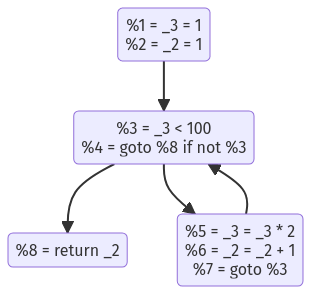

# IRViz

[](https://github.com/oxinabox/IRViz.jl/actions/workflows/CI.yml?query=branch%3Amain)


IRViz is about generating visualizations of the code that the Julia Compiler is generating.

## Getting started
There is one function in the package right now: `viz`, it takes a `CodeInfo` as input and makes a connected graph visualization of the code flow graph.


```julia
julia> using IRViz

julia> function foo()
           x = 1
           y = 1
           while x < 100
               x*=2
               y+=1
           end
           return y
       end
foo (generic function with 1 method)

julia> viz(@code_typed optimize=false foo())
```
Would create the output:


## See also:
 - [Cthulhu.jl](https://github.com/JuliaDebug/Cthulhu.jl)
 - [ShowCode.jl](https://github.com/tkf/ShowCode.jl)